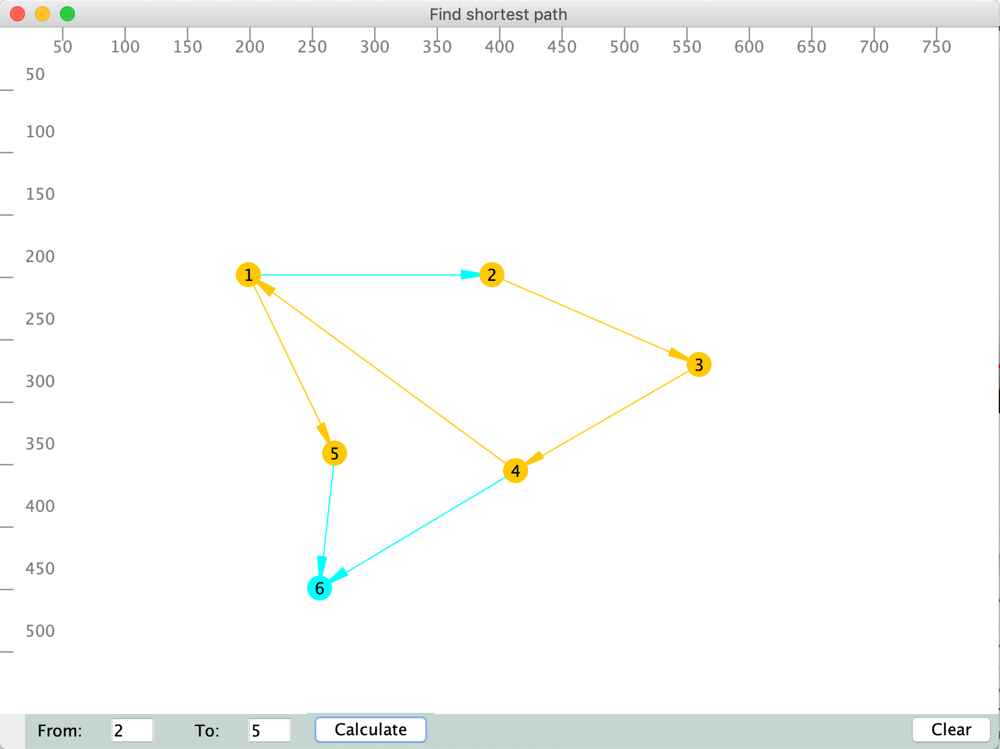

# findShortestPathSwingApp

This is a Swing desktop app which shows how to calculate shortest in the graph.

App has drawing panel where user:
 - adds new vertexes by clicking to empty area
 - removes added vertex by clicking to existed vertex (it also remove connections)
 - adds direct connections by dragging from one vertex to another vertex
 
App has 2 action buttons:
- calculate (from and to should be prepopulated) which highlight the shortest path from vertex and to vertex
- clear which remove all vertexes and their connections from the drawing pannel

Application uses <a href=https://jgrapht.org/>JGraphT library</a>

